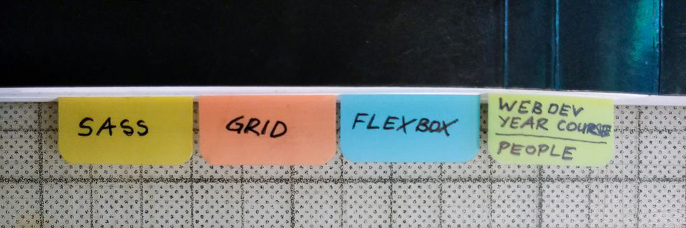

# Webdevelopment Notes

Collected notes, tools and links for webdevelopment. Always growing, because the space in my head is taken up with useless information instead.

## DCI / André

 * [FBW2-Lei / General](https://github.com/fbw2-lei/general) - Curriculum, Goals, Learning Blocks, etc.
 
## Other Online Courses / Ressources
 
 * [GitHub Student Developer Pack](https://education.github.com/pack/offers)
 * [Frontend Masters](https://frontendmasters.com/dashboard/)
 * [Wes Bos Courses](https://wesbos.com/courses)

## Visual Studio Code

 * [Pascal's original notes](vsc-pascal.md) - updated for Linux
 * [VSC Extentions](vsc-extentions.md)
 * [Horizon Theme](https://horizontheme.netlify.app/)

## Git / GitHub

* [Caching GitHub password](https://help.github.com/en/github/using-git/caching-your-github-password-in-git)
* [GitHub Status](https://www.githubstatus.com/)

## HTML5

 * [Color Names](https://colours.neilorangepeel.com/)
 * [Semantic Tags](https://www.vikingcodeschool.com/html5-and-css3/html5-semantic-tags)

## CSS

 * [CSS selectors](https://estelle.github.io/cssmastery/selectors/selectors.html)
 * [Selector Game](https://flukeout.github.io/)
 * [Border Styles](https://codepen.io/coffeepyros/pen/BaoLpEN) (CodePen)
 * [Font Stacks](https://css-tricks.com/snippets/css/font-stacks/)
 * [Font size to point size translation](https://stackoverflow.com/questions/5912528/font-size-translating-to-actual-point-size)
 * [Box Shadows](https://codepen.io/coffeepyros/pen/wvKPRog) (CodePen)
 
 ### CSS Flexbox
 
 * [Complete Guide to Flexbox](https://css-tricks.com/snippets/css/a-guide-to-flexbox/)
 * [Flexbox Froggy Game](https://flexboxfroggy.com/#de)
 * [Flexbox in GIFs](https://www.freecodecamp.org/news/even-more-about-how-flexbox-works-explained-in-big-colorful-animated-gifs-a5a74812b053/)
 * [Flex-Basis](https://www.freecodecamp.org/news/flex-basis-property-in-flexbox/)
 
### CSS Grid
 
 * [Complete Guide to CSS Grid](https://css-tricks.com/snippets/css/complete-guide-grid/)
 * [Grid Garden Game](https://cssgridgarden.com/)
 * [CSS Grid Course by Wesbos](https://cssgrid.io/)
 * Grid: [Layout Land](https://www.youtube.com/channel/UC7TizprGknbDalbHplROtag) - Youtube Channel by Jen Simmons (one of the main developers of CSS grid)

### CSS Clip-Path, Scale, Transform, Gradients

 * [Clippy](https://bennettfeely.com/clippy/)
 * [CSS Gradient Backgrounds](https://cssgradient.io/) 
 
### Icons
 
 * [Font Awesome 4.7](https://fontawesome.com/v4.7.0/examples/) (old version, but free)
 * `<link href="https://stackpath.bootstrapcdn.com/font-awesome/4.7.0/css/font-awesome.min.css" rel="stylesheet" integrity="sha384-wvfXpqpZZVQGK6TAh5PVlGOfQNHSoD2xbE+QkPxCAFlNEevoEH3Sl0sibVcOQVnN" crossorigin="anonymous">`
 * [W3C School Intro to Font Awesome](https://www.w3schools.com/icons/fontawesome_icons_intro.asp)
 * [Hosting Font Awesome Yourself](https://fontawesome.com/how-to-use/on-the-web/setup/hosting-font-awesome-yourself)

### Advanced CSS

 * [CSS Tricks](https://css-tricks.com/)
 * [State of CSS in 2019](https://2019.stateofcss.com/)
 
## JavaScript

 * [State of CSS in 2019](https://2019.stateofcss.com/)

## Magazines / Blogs

 * [Increment Magazine, Issue #13 - Frontend](https://increment.com/frontend/)
 * [Smashing Magazine (Online)](https://www.smashingmagazine.com/)
 * [The Web Ahead](http://thewebahead.net/topics)
 * [The State of Things in 2020](https://twitter.com/smashingmag/status/1280422442083762176) 
 
## Typography

 * [Rock Salt](https://fonts.google.com/specimen/Rock+Salt) (Handwriting)
 * [Fluid Typography](https://www.smashingmagazine.com/2016/05/fluid-typography/)
 * [Web Typography Tutorial](https://www.internetingishard.com/html-and-css/web-typography/)
 * [Free Faces](https://freefaces.gallery/)
 * [The 40 Best Free Fonts Available on Google Fonts](https://www.typewolf.com/google-fonts)
 * [Type-X](https://github.com/arrowtype/type-x) - Chrome extension to test different fonts directly on a website
 * [Premium Free Fonts](https://medium.com/fresh-fonts/free/home)

### Coding Fonts

 * [IBM Plex Mono](https://fonts.google.com/specimen/IBM+Plex+Mono)
 * [Inconsolata](https://fonts.google.com/specimen/Inconsolata)
 * [Input Mono](https://input.fontbureau.com/)
 * [JetBrains Mono](https://www.jetbrains.com/lp/mono/)
 * [Fira Code](https://github.com/tonsky/FiraCode)
 * SF Mono
 * [Dank Mono](https://gumroad.com/l/dank-mono)

## General Coding

 * [Learn to code with games](https://codepip.com/)
 * [Unicode character table](https://unicode-table.com/en/25BC/)

## Illustrations

 * [https://icons8.com/ouch](https://icons8.com/ouch)
 * [https://undraw.co/illustrations](https://undraw.co/illustrations)
 * https://www.drawkit.io/
 * https://www.manypixels.co/gallery/
 * https://webkul.github.io/vivid/
 * https://www.humaaans.com/
 * https://iradesign.io/
 
 ## SVG
 
 * [SVG Backgrounds](https://www.svgbackgrounds.com/)

## Unsorted / Quick Dump

https://www.samanthaming.com/tidbits/
